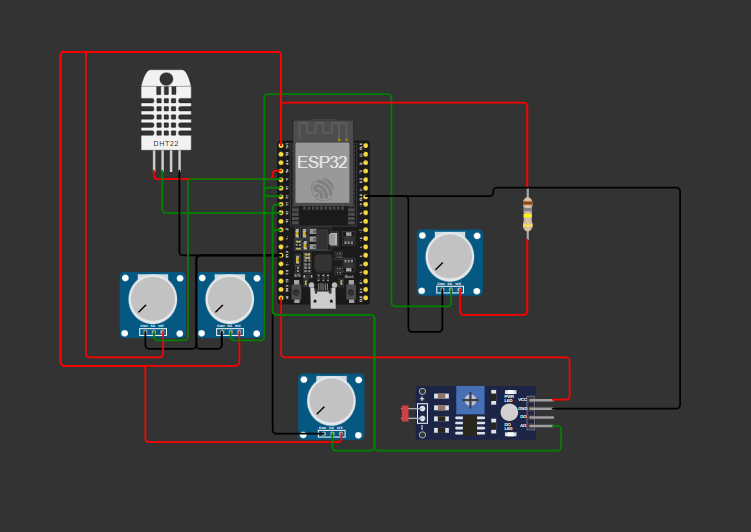
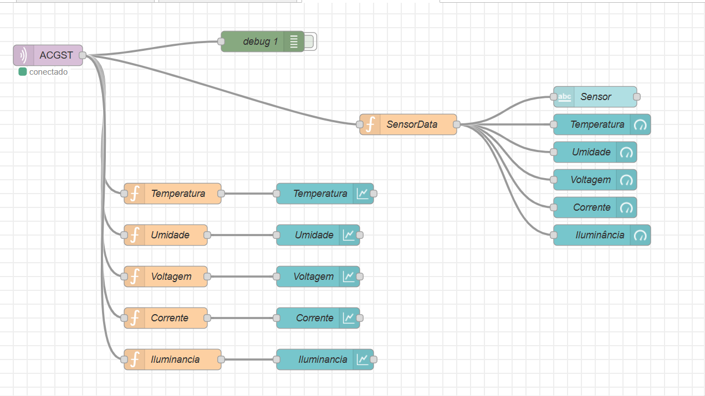
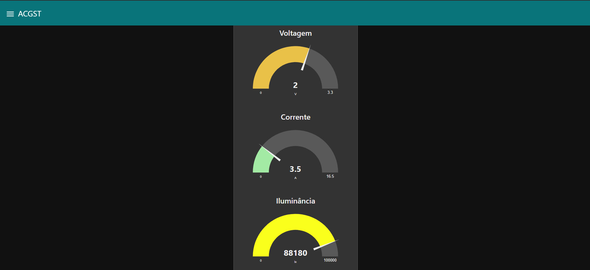
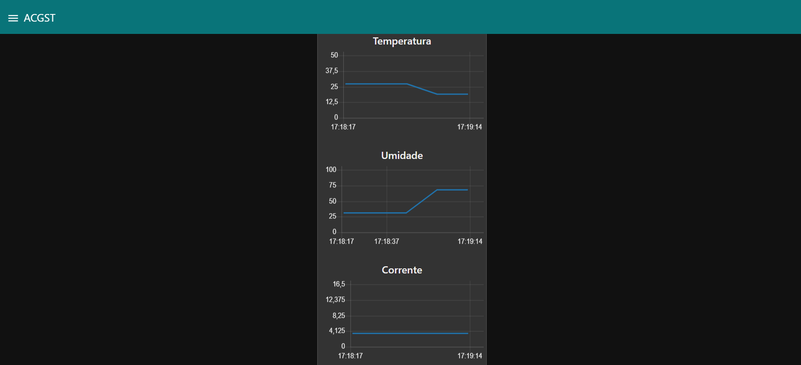
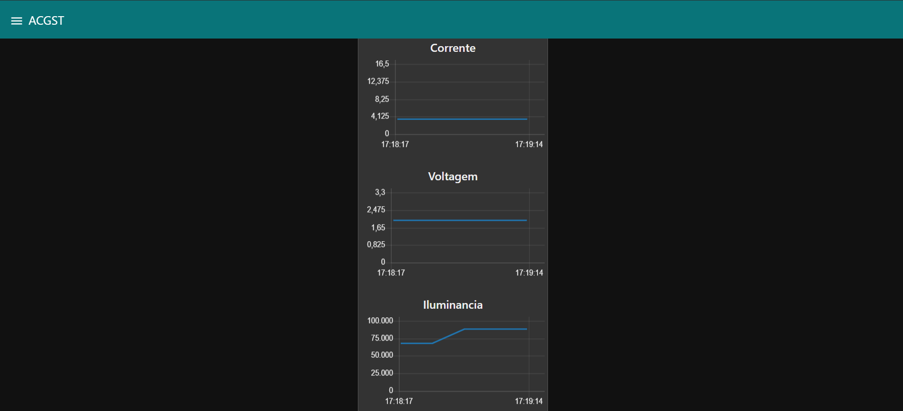

# WattEco

 ## Integrantes:
 Ana Clara Rocha de Oliveira 
 Thiemi Hiratani Favaro 
 Stephany Siqueira 
 Camila dos Santos Cunha 
 Guilherme Castro 

 ---

**WattEco** é um aplicativo educativo e interativo projetado para incentivar o consumo consciente de energia. Utilizando missões gamificadas, o app ensina os usuários a adotar práticas sustentáveis, reduzindo o consumo de energia, promovendo o uso de fontes renováveis e contribuindo para um futuro mais verde.

## Objetivos

O principal objetivo do projeto é fornecer uma plataforma que permita aos usuários:

- Melhorar suas práticas de consumo energético.
- Aprender sobre eficiência energética e fontes renováveis.
- Monitorar e otimizar o uso de energia elétrica em suas residências.
- Receber feedback em tempo real sobre o impacto positivo de suas ações, como a redução de emissões de CO₂ e kWh economizados.

### Sensores e Coleta de Dados

Para simular um sistema de monitoramento de energia, utilizamos o [Wokwi](https://wokwi.com) para emular sensores e um ESP32 para processar e transmitir dados. A configuração inclui:

- **Sensor DHT22**: Para coleta de dados de temperatura e umidade.
- **Sensor LDR (Light Dependent Resistor)**: Para medir a intensidade luminosa.
- **Sensor ACS712**: Simulação de um sensor de corrente para monitorar o consumo de energia.

Os dados desses sensores são processados pelo ESP32 e enviados via **MQTT** para um dashboard, utilizando o **Node-RED** para exibição em tempo real.

### Exibição de Dados

O **Node-RED** é utilizado para criar um dashboard que exibe as leituras dos sensores, incluindo:

- Temperatura
- Umidade
- Luminosidade (convertida de resistência para lux)
- Consumo de energia 

Os dados são transmitidos em formato **JSON**, usando a biblioteca **ArduinoJson** para a formatação e estruturação das informações.

### Arquitetura da Solução

- **ESP32**: Microcontrolador responsável por coletar e processar os dados dos sensores.
- **MQTT Broker**: Facilita a comunicação entre o ESP32 e o dashboard.
- **Node-RED**: Utilizado para visualizar os dados e configurar a interface de monitoramento em tempo real.

### Funcionalidades

- **Monitoramento Remoto**: O sistema permite que os usuários acompanhem as condições ambientais de suas residências de forma remota.
- **Feedback em Tempo Real**: A interface oferece uma visão instantânea de como pequenas ações podem impactar positivamente o consumo energético.

## Possíveis Expansões

- **Automação com Atuadores**: Além de monitorar o ambiente, a solução pode ser ampliada para controlar dispositivos como ventiladores e iluminação.
- **Notificações em Tempo Real**: A integração com serviços como **IFTTT** ou **Telegram** pode alertar os usuários quando os sensores detectarem valores fora do padrão.
  
## Benefícios da Solução

- **Fácil Monitoramento**: A solução oferece uma maneira simples e eficiente de monitorar as condições ambientais e o consumo de energia de forma remota.
- **Automação Simples**: A inclusão de atuadores possibilita que o sistema ajuste automaticamente as condições ambientais com base nas leituras dos sensores.
- **Alta Escalabilidade**: Usando plataformas acessíveis como **ESP32**, **MQTT** e **Node-RED**, a solução é replicável e escalável para diferentes cenários.

## Como Simular o Projeto

Para simular o projeto, utilizamos o **PlatformIO** e o **Wokwi** no **VSCode**. 

### Passos:

1. **Build do Ambiente**: Configure o ambiente de firmware no **PlatformIO**.
2. **Simulação no Wokwi**: Após o build, com a extensão do Wokwi, você pode rodar a simulação diretamente no terminal.
3. **Teste Online**: O projeto pode ser testado diretamente no Wokwi através deste link:
   [Wokwi Simulation](https://wokwi.com/projects/414294162990740481).